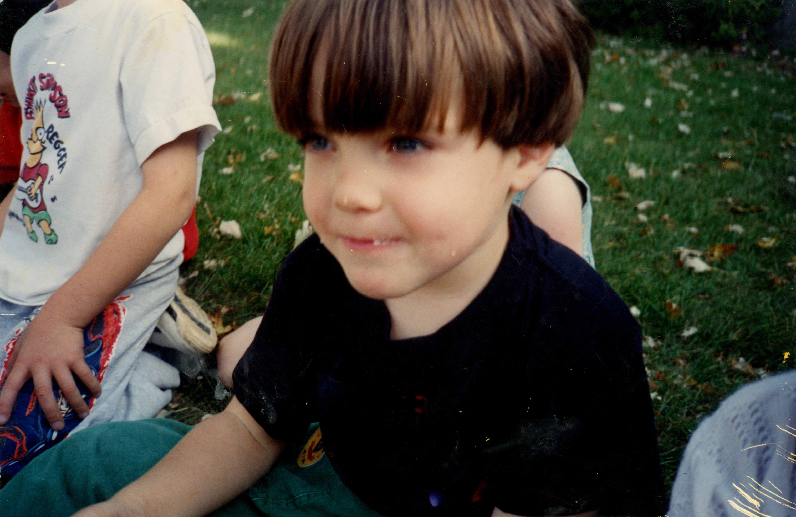
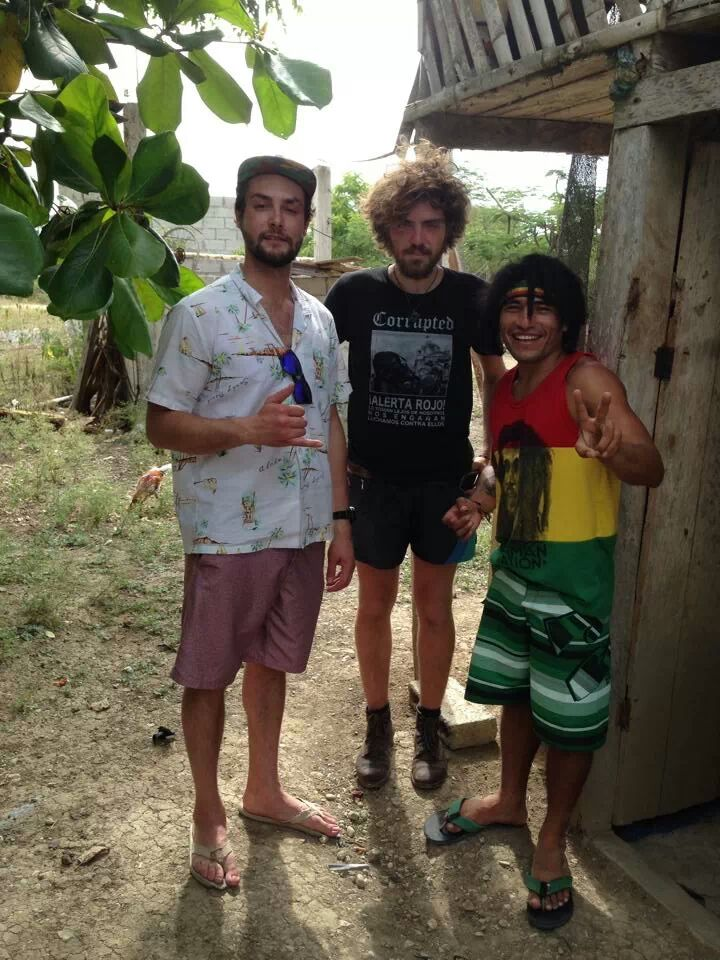
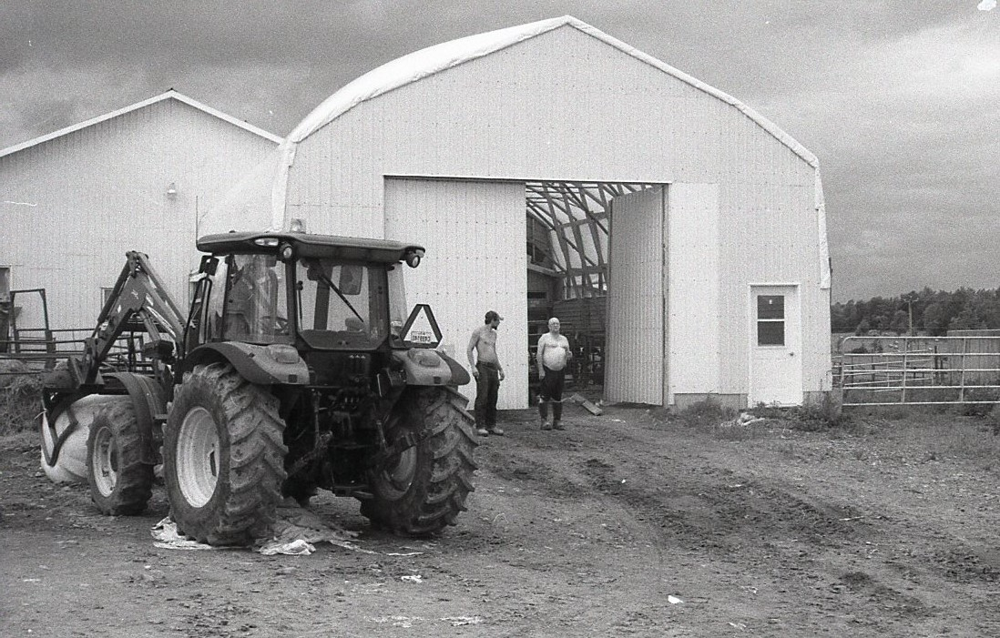
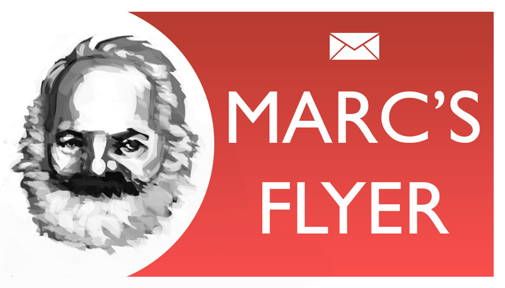

Thinkpad X230, vim, flip-phones --- modernity in *Vampyr* and *Nosferatu*; [the atmosphere](https://letterboxd.com/theinvertedform/list/john-carpenter-ranked) of the first half of *They Live*; *[Garten der Unbewusstheit](https://youtu.be/3t5aDYQsnUI?si=B6qcCsH7rfh2pLZ4)* --- *sprezzatura*, Harpo Marx and the Tramp --- an A6 notebook, every line filled with writing, a red fountain pen, binders filled with pages of notes collected over years, binders filled with 35mm negatives, bundles of letters, *Zettelkasten* --- [an obsolete vision of an alternative future](https://en.wikipedia.org/wiki/Project_Xanadu); forgotten books, looking at adjacent titles in the library stacks; systems for organizing information --- ancient wisdom, traditional methods, something from out of time, the *via negativa* --- Kierkegaard and Nietzsche, Hegel and Kant, Karl Marx, Walter Benjamin, Theodor Adorno, Georg Lukacs --- creation stories; modernism in the early 20th century, a warm and cozy cafe; lovesickness, heartbreak, the vertigo of being caught up in love, the pain of being alive; a cabernet franc, pasta carbonara, kombucha, yogurt, potato, dark chocolate, a coffee with some milk; Courbet, Degas, Masson; Duchamp, Beeple; Judd, Lewitt; Bourgeois and Eamon; Burtynsky, Michael Snow; Hong Sang-soo, Samira Makhmalbaf, Joanna Hogg; The Replacements, The Field, choir; squats, dips and chinups, overhead press, jump rope ---

# [Fiction and memoir](#fiction-and-memoir)

On this website, I have published excerpts from my Diary, which I describe as an "autofictional practise of narrative construction." I have written many stories that are taken from my life, with characters based on people I know. What kind of relation does any of this have to the Truth? The goal of fiction is to represent the Truth, and therefore it ought to involve an element of the author's experience. However, we cannot seriously make an equation between a literary effect and a real person.

# [Biographical Summary](#biographical-summary)

The author was born on November 17, 1990 at 457 Main Street, in Toronto, Ontario, and given the name Uriah Marc Todoroff. My maternal grandfather was descended from a long line of French colonists; my grandmother was Franco-Manitoban. On my father's side, my grandmother was a Scottish immigrant who I met only once. My grandfather, a Bulgarian immigrant, died long before I was born.

At fourteen, I moved to Montréal. I lived with my aunt and started attending a small, ["alternative" high school](https://en.wikipedia.org/wiki/MIND_High_School). I moved between schools in Montréal and Toronto, before eventually dropping out altogether circa 2007, age 16.

I moved around a lot, tried many different types of work. After I read *Thus Spoke Zarathustra* and *On the Road* back-to-back, I convinced myself that the "mountain-top" Zarathustra spoke about would involve a hobo sojourn. I was on the road for a year.

I didn't find myself. The days were driftless and I was constantly on the outside. No home: nowhere to enter into; all I saw were faces. It's exhausting. I needed to relax. I needed to feel like I actually lived somewhere. It was Montréal, the only place I had ever felt settled. I needed to return home and make it my home.

At some point in the first half of 2016, I applied to Concordia for an undergraduate degree in philosophy. I took another month off to go to Halifax. Hitching home, I was stopped off at this dairy farm when I got the news that I had been accepted.

# [Professional Experience](#professional-experience)

The following list of work experience does not include one-off, freelance, or volunteer positions. A "job" is loosely defined as anything that reoccurred over at least two pay periods. This list is not comprehensive.

## [Work Experience](#work-experience)

* Flyer delivery for friends of my parents (circa 1995--1999)
* Helping my dad out on job sites (circa 1995--2003)
* Shovelling neighbours' walks (circa 1997--2003)
* Working for other bricklayers, including Edmund Yee, Shane Oake, Clint Turnbull (circa 2001--2021)
* T-Bones on Eglinton (2007--2008)
* The Bowl on Yonge near Wellesley (2007--2008)
* Oxford Cafe on Ste-Catherines
* M-Burger
* Bofinger's, downtown Montréal
* Folding boxes for a startup
* Delivering flyers in Thorn Hill for a real estate agent
* Melanie's Bistro
* Lawrence / Larrys (2014--2020)
* Cafe Guerrero (2021)
* Cafe Lucy (?) on Bernard for about 3 weeks
* Bar Bara (June--July 2022)
* McKiernan's (June--September 2022)
* Reservoir (June 2023--October 2023)
* Darna Bistroquet (November 2023--*present*)
* [Atelier--Galerie A. Piroir](https://piroir.com) (January 2024--*present*)

## [Volunteer Experience](#volunteer-experience)

* SOPHIA Concordia
* Sorting tax documents for the Church of Scientology
* The Sophia Review
* Fantasia
* Festival du Nouveau Cinema

# [Education](#education)

* [Secord Elementary](https://torontolife.com/city/toronto-is-failing-me-my-kids-school-is-a-disgrace/) (Toronto, circa 1993--1998, 1999)
* General Crerar Primary (Toronto, circa 2001)
* [MIND High School](https://en.wikipedia.org/wiki/MIND_High_School) (Montréal, circa 2004--2005; 2007)
* Options II (Montréal, circa 2006--2007)
* David & Mary Thompson Collegiate Institute (Toronto, circa 2007--2008)
* Concordia University (Montréal, 2016--2019; 2021-2023)

# [Personality](#personality)

Gass referred to the writing life as "a life in the chair." A desk chair, or an electric chair?

## [Astrological chart](#astrological-chart)

Scorpio, rising Sagittarius. Full chart and reading forthcoming. Mars dominates my chart, but I have always preferred Pluto as a personal icon. I like astrology as a symbolic language, and a future project will be to analyze statistical correlations in certain readings. I like the materialism of astrological metaphysics...of course, I should admit as well that it has always been a useful tool for processing emotions. I have not studied astrophysics, I know barely anything about the history of astrology, and I am not even familiar with the signs, except for in a superficial way. Although my knowledge is superficial, my interest is genuine.

## [Personality Tests](#personality-tests)

* [YourMorals.org Moral Foundations Questionnaire-2](/assets/documents/mfq2-2022.pdf) (2022)
* [Relationship Survey](/assets/documents/relationship-survey-2022.pdf) (2022)
* 16Personalities: "Advocate" (INFJ-T)
*Advocates are quiet visionaries, often serving as inspiring and tireless idealists. These rare types are open-minded and imaginative, applying care and creativity.*

# [Contact](#contact)

Here are links to the social media accounts that I am active on. I can be reached through direct message on any of these platforms. It brings me great joy to hear feedback from people on anything that I have produced. Please get in touch. If you prefer, you can [email me](mailto:um.todoroff@gmail.com) or [leave anonymous feedback](https://docs.google.com/forms/d/e/1FAIpQLSckpSDCKX3uNollW7CJmZF5V3zumIljoDAWsf8ftB6HTNJIKw/viewform).

My username is theinvertedform. The inverted form and the inverted world both recur throughout Hegel and Marx. I like "theinvertedform," especially as it's set.

1. [Twitter](https://twitter.com/theinvertedform)
4. [Substack](https://umtworld.substack.com)
2. [Letterboxd](https://letterboxd.com/theinvertedform)
4. [Goodreads](https://www.goodreads.com/user/show/122256622)
4. [Patreon](https://patreon.com/umtworld)
3. [Last.fm](https://www.last.fm/user/aeymxq)
2. [Github](https://github.com/theinvertedform)
3. [Reddit](https://reddit.com/u/theinvertedform)
