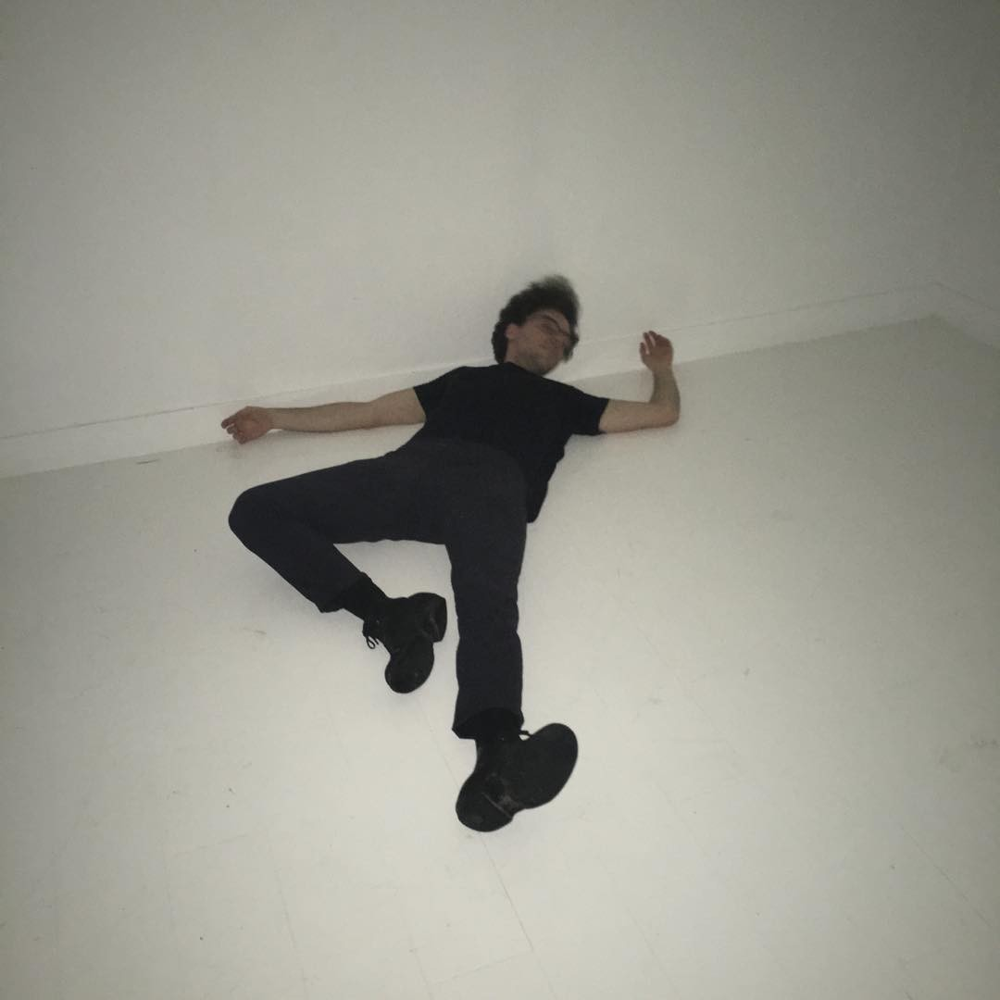

Thinkpad X230, vim, flip-phones --- modernity in *Vampyr* and *Nosferatu*; [the atmosphere](https://letterboxd.com/theinvertedform/list/john-carpenter-ranked) of the first half of *They Live*; *[Garten der Unbewusstheit](https://youtu.be/3t5aDYQsnUI?si=B6qcCsH7rfh2pLZ4)* --- *sprezzatura*, Harpo Marx and the Tramp --- an A6 notebook, every line filled with writing, a red fountain pen, binders filled with pages of notes collected over years, binders filled with 35mm negatives, bundles of letters, *Zettelkasten* --- [an obsolete vision of an alternative future](https://en.wikipedia.org/wiki/Project_Xanadu); forgotten books, looking at adjacent titles in the library stacks; systems for organizing information --- ancient wisdom, traditional methods, something from out of time, the *via negativa* --- Kierkegaard and Nietzsche, Hegel and Kant, Karl Marx, Walter Benjamin, Theodor Adorno, Georg Lukacs --- creation stories; modernism in the early 20th century, a warm and cozy cafe; lovesickness, heartbreak, the vertigo of being caught up in love, the pain of being alive; a cabernet franc, pasta carbonara, kombucha, yogurt, potato, dark chocolate, a coffee with some milk; Courbet, Degas, Masson; Duchamp, Beeple; Judd, Lewitt; Bourgeois and Eamon; Burtynsky, Michael Snow; Hong Sang-soo, Samira Makhmalbaf, Joanna Hogg; The Replacements, The Field, choir; squats, dips and chinups, overhead press, jump rope ---

# Fiction and Memoir

On this website, I have edited together a selection of excerpts from my [Diary](/diaries). I describe this ongoing project as an "autofictional practise of narrative construction." It has been instructive as a process of creating an emotional and psychological reality through description. It has also given me practise shaping a larger body of text into something structured.

The narratives in my fiction are usually taken from experience. Either things that transpired directly to me, or to people I know. What kind of relation does any of this have to the Truth? Fiction shares the same obligation as philosophy: to represent the truth. For a work to claim epistemological certainty, it needs to be derived from experience.

If we look at the history of art and literature, we will see that it's common for the life of an artist to parallel the content of their work work. And why should we expect it to be any other way? How can we expect a truth of life to be revealed through the fabricated content of the machine of literature?

It's even normal to have debate on the topic...but for whatever reason, we Contemporaries can't help but worry about whether the story happened to the author or not. It's why we can only read writing in the first person. To be fair, the reader has a right to expect Truth from their fiction. But the answer is not to return to pretending that the author is anything less than *dead*. We should not revert to psychologizing the author. It's disrespectful! The fiction is only a fiction: it's a completely different type of Being than a real, living human.

The *Diaries* intentionally trade on this ambiguity. Take it for what it is.

# Biographical Summary

The author was born on November 17, 1990 in Toronto, Ontario. My father named me Uriah, and my mother named me Marc. I moved to Montréal at 14 (2005), and have lived here (mostly) since then. I do manual labour to support myself, usually working in restaurants. I went to school at age 25 and in 2023 graduated with a Bachelor of Fine Arts, double major in Philosophy and Art History & Film Studies.

# The Quantified Self

I could never pull the degree of quantification that some people go for. It's not just because of the energy it takes, but it's just a hideous way to live.

## The Institutionalized Self

Don't we all love to have a job? Aside from a brief moment self-employed as a junk mail delivery man, I have preferred to work for others so as to reserve my energy for this website. It's not worth listing them.

And what's better than having a job? Why, it could only be going to school. Here are the ones that I attended:

* [Secord Elementary](https://torontolife.com/city/toronto-is-failing-me-my-kids-school-is-a-disgrace/) (Toronto, circa 1993--1998, 1999)
* General Crerar Primary (Toronto, circa 2001)
* [MIND High School](https://en.wikipedia.org/wiki/MIND_High_School) (Montréal, circa 2004--2005; 2007)
* Options II (Montréal, circa 2006--2007)
* David & Mary Thompson Collegiate Institute (Toronto, circa 2007--2008)
* Concordia University (Montréal, 2016--2019; 2021-2023)

Gass referred to the writing life as "a life in the chair." A desk chair, or an electric chair?

## Astrological chart

Scorpio Sun, rising Sagittarius.

## Personality Tests

* [YourMorals.org Moral Foundations Questionnaire-2](/assets/documents/mfq2-2022.pdf) (2022)
* [Relationship Survey](/assets/documents/relationship-survey-2022.pdf) (2022)
* 16Personalities: "Advocate" (INFJ-T)
*Advocates are quiet visionaries, often serving as inspiring and tireless idealists. These rare types are open-minded and imaginative, applying care and creativity.*

# Contact

Please follow and reach out on any of these platforms. Feedback is important: if you've made it this far, I want to know what you think. Any questions? Anything to share? Get in touch. If you prefer, you can [email me]({{ site.author.email }}) or [leave anonymous feedback](https://docs.google.com/forms/d/e/1FAIpQLSckpSDCKX3uNollW7CJmZF5V3zumIljoDAWsf8ftB6HTNJIKw/viewform).

1. [Twitter](https://twitter.com/theinvertedform)
4. [Substack](https://umtworld.substack.com)
2. [Letterboxd](https://letterboxd.com/theinvertedform)
3. [Instagram](https://instagram.com/theinvertedform)
4. [Goodreads](https://www.goodreads.com/user/show/122256622)
4. [Patreon](https://patreon.com/umtworld)
3. [Last.fm](https://www.last.fm/user/aeymxq)
2. [Github](https://github.com/theinvertedform)
3. [Reddit](https://reddit.com/u/theinvertedform)
