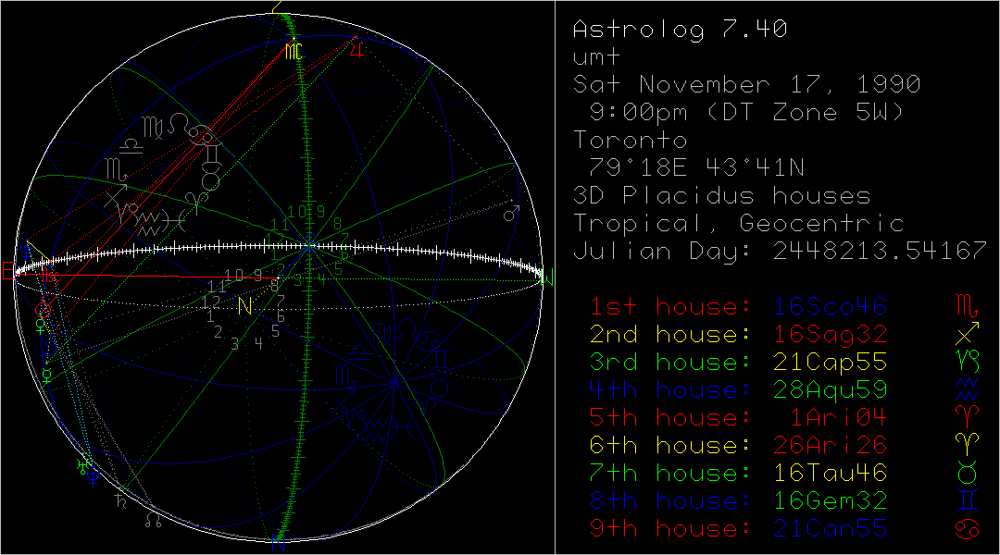

Things I like: the Thinkpad X220, whistling into a payphone to get free calls, vim, flip-phones; the technologism of *Vampyr* and *Nosferatu*; John Carpenter's atmospheric filmmaking; *Garten der Unbewusstheit*; *sprezzatura*, gentlemen hoboes, vintage militaria, Sly's workout fits in the first *Rocky*; black A6 notebooks, every line filled with writing, a red fountain pen, binders filled with pages of notes collected over years, binders filled with negatives, bundles of letters; obsolete visions of an alternative future; forgotten books, looking at adjacent titles in the library stacks; systems for organizing information; tried-and-true techniques, things that haven't changed, the *via negativa*; Kierkegaard more than Nietzsche, Hegel more than Kant, Marx more than anyone; creation stories; modernism in the early 20th century, "Kafkaesque" used to describe a warm and cozy bar; lovesickness, heartbreak, the pain that comes with being alive; natural wines, pasta carbonara, kombucha, yogurt, chocolate, a coffee with some milk; Courbet, Manet, Degas, Breton, Masson; Duchamp, Warhol, Beeple; Judd, Lewitt; Freud, Bacon, Bourgeois, Eamon; Burtynsky; The Replacements; squats, overhead press, pushing the weight sled; toxic shades of purple and green;

How do you get to know a man? Through his choice of self-presentation? What constitutes an introduction? In the abstract of this page, I include my practitioner's statement. It is intended to describe how I see myself---what I want to be as an artist and a scholar. Some of the sections on this page deal with my tastes in certain domains; some of them attempt to quantify my personality and worldview; still others describe my tools and workflows. However, the most important parts, in my view, are the biographical overview and the photos that I will endeavour to add.

# Biographical summary

## 1990--2004

I was born on November 17, 1990 and given the name Uriah Marc Todoroff. Marc is for my mother's brother, who died in Saskatchewan around 13 years old. He's buried there next to his parents, Norman and Georgette Raymond. That's where my mother grew up with her three sisters and three (now two) brothers. Dad grew up around Gravenhurst, Ontario. Now it's cottage country, where those of his six sisters who still live are retired. They're all over six feet tall, and "big-boned," like a family of giants. His dad came from Bulgaria and died before I came on the scene. I was told that he used to own a restaurant. I met his mother once, maybe around 3 or 4 years of age. All I remember is her blind hands on my face. Old Isabella, who came here from Scotland. Dad died April 5, 2005. Mom gave my sister and three brothers French names. I was the only one she allowed to give a first name to, and he rewarded us both by choosing a rare name. Knowing that dad was a metalhead, I assume that it is taken from the band Uriah Heep (named after a character in a Dickens novel. My dad read a lot, but I don't know if Dickens was his speed).

I grew up in Toronto. It says East York on my birth certificate, but that place-name has since been amalgamated into the GTA. We moved a few times throughout my childhood, each time further east, eventually settling in Scarborough. I used to steal cigarettes from my dad, smoke cigarette butts, shoplift candy, skip school a lot, start fires, run around in parking garages, throw rocks at cars from overpasses, run around with gangs of kids getting into fights with other gangs of kids, breaking every window in the school, terrorizing small business owners, throwing eggs at buses, playing Nicky Nicky Nine Doors, stealing the bulbs from Christmas lights and smashing them. I also used to read a lot, and write poetry and little stories and draw and listen to music.

## 2005--2009

I wasn't in school, I wasn't really doing anything when dad started dying. This is the first major dark period in my life. I was highly emotional---used to write poetry like mad, then throw the book against the wall and burst into tears. I took the option of moving to Montréal. Anything was better than nothing. I lived with my aunt Lorraine and started attending an "alternative" high school that she had found. I started off quite poorly socialized, but eventually fell in with another gang in the tiny school. Typical teenage behaviour of drinking, smoking, listening to music, shoplifting, doing whatever drugs I could get my hands on, climbing things, saying stupid things, vandalizing things, falling in love, not having sex, yearning to be a writer but not practicing enough. I kept it up for a few years---moved between a few high schools in Montréal before going back to Toronto to try the classic big high school experience. I made it less than a year before I finally dropped out to work at a 24-hour burger joint. T-Bones, on Eglinton. Everything around there has changed, but T-Bones is somehow still there. This would be in 2007, at the age of 16.

The next major stage of development occurs around 2008--09, when I was around 18--19 years old. I moved to Stanstead, QC, in the Eastern Townships. Right on the border of Vermont. I worked for Sunset Pictures and Bashar Shbib, a major influence in my life that I can't talk about right now.

After that it's living on Greene with Jesse, Luke and Cal. That's where I lost my virginity at the age of 19. Laurin Liu, who holds the record for youngest member of parliament.

Then, onto welfare and living alone by Parc Lafontaine. The second major darkness. I was only there for about 8 months, even though it felt like forever.

## 2010--2014

After that, returning to Toronto and starting to pull myself together. The years of Marc's Flyer. Living alone, supporting myself through the constant hustle. Introduction to Outlier. Maggie.

The travelling years.

Return to Montréal. Starting at Lawrence. Noelle.

## 2015--2019

Centre Saint-Louis. Eden. Noelle, concluded. Summer spent in Halifax micro-dosing on LSD. Starting at Concordia.

## 2020--2022

The Rachelle Years. The good years.

## 2023--*present*

End of the good years; yet another period of darkness. I suspect this one will last forever.

# Professional Experience

A chronological list of every job I have held, with dates given when known. This does not include one-off, freelance, or volunteer positions. A "job" is loosely defined as anything that reoccurred over at least two pay periods. This list is not comprehensive.

* Flyer delivery for friends of my parents (circa 1995--1999)
* Helping my dad out on job sites (circa 1995--2003)
* Shovelling neighbours' walks (circa 1997--2003)
* Working for other bricklayers, including Edmund Yee, Shane Oake, Clint Turnbull (circa 2001--2021)
* T-Bones on Eglinton (2007--2008)
* The Bowl on Yonge near Wellesley (2007--2008)
* Oxford Cafe on Ste-Catherines
* M-Burger
* Bofinger's, downtown Montréal
* Folding boxes for a startup
* Delivering flyers in Thorn Hill for a real estate agent
* Melanie's Bistro
* Lawrence / Larrys (2014--2020)
* Cafe Guerrero (2021)
* Cafe Lucy (?) on Bernard for about 3 weeks
* Bar Bara (June--July 2022)
* McKiernan's (June--September 2022)
* Reservoir (June 2023--October 2023)

* SOPHIA Concordia
* Sorting tax documents for the Church of Scientology
* The Sophia Review
* Fantasia

# Education

* [Secord Elementary](https://torontolife.com/city/toronto-is-failing-me-my-kids-school-is-a-disgrace/) (Toronto, circa 1993--1998, 1999)
* General Crerar Primary (Toronto, circa 2001)
* [MIND High School](https://en.wikipedia.org/wiki/MIND_High_School) (Montréal, circa 2004--2005; 2007)
* Options II (Montréal, circa 2006--2007)
* David & Mary Thompson Collegiate Institute (Toronto, circa 2007--2008)
* Concordia University (Montréal, 2016--2019; 2021-2023)

# The Artist's Studio

## My computer

* ThinkPad X1 Carbon (5th gen). This is my main computer. I have a desktop that I use as a media server and as a backup. The laptop is starting to show its age. I yearn for a fully-modded Thinkpad X220.
* Gentoo Linux since roughly Summer 2020. Arch Linux for years before then. A brief spell of using Windows on a laptop, preceded by not having one. I first started experimenting with Linux around the age of 16, using Slackware and Ubuntu for a number of years.
* Vim. Against my best intentions, this editor has become a significant part of my identity and a crucial part of how I understand new media from a research--creation perspective.
* I have a generic 60% mechanical keyboard with Cherry MX Brown switches. I like it and I like the tactility, but I hope to one day upgrade to either a vintage IBM Model M, or its continuation, the Mini-M.
* I run a [fork](https://github.com/theinvertedform/dwm) of the [dwm](https://dwm.suckless.org) window manager, alongside a [fork](https://github.com/theinvertedform/st) of the [simple/suckless terminal](https://st.suckless.org)

## Note-taking and study methods

Studying is particular, and I am by no means claiming to be an expert. I like the system I have developed: it's quite simple, and makes sense to me. I try to remove as many arbitrary obstacles as possible. Basically, that means keeping lecture notes on loose-leaf, three-ring punch paper---the most common type of paper, in my experience. Notes use a simple indentation system, where I write the main point or concept, and track an argument through levels of indentation.

Recently, in my final semester, I learned about the concept of Zettelkasten, or the systematic use of index cards as a technique for organizing notes. I learned about it from my research into Walter Benjamin's practises. More information on this is forthcoming when I gain more experience on the matter.

## The process of writing

Gass called it "a life in the chair," the parallel being to the electric chair. A life spent at the fatal terminus of punishment.

# Profile

I default to introverted, but am secretly gregarious. I am emotionally unstable, highly sensitive---and yet, annoyingly implacable.

## Lifestyle

## Appearance

How can you know me, without knowing what I look like? Here is a description of my style, how I comport myself; I will also collect photographs to construct a chronological visual narrative.

## Astrological chart

Scorpio, rising Sagittarius. Full chart and reading forthcoming. Mars dominates my chart, but I have always preferred Pluto as a personal icon. I like astrology as a symbolic language, and a future project will be to analyze statistical correlations in certain readings. I like the materialism of astrological metaphysics...of course, I should admit as well that it has always been a useful tool for processing emotions. I have not studied astrophysics, I know barely anything about the history of astrology, and I am not even familiar with the signs, except for in a superficial way. Although my knowledge is superficial, my interest is genuine.

## Personality

Data forthcoming. I took the MBTI once when I was 18, and remember that I was an INTJ. We'll see how I compare these days.

## Morals and philosophy

Some keywords for you:

1. Cosmology: Epicurean atomism
2. Metaphysics: materialist
3. Ontology: force
3. Ethics: virtue ethics
4. Politics: Maoist

## Tastes

### Music

### Films

### Books

### Art

# Contact

Here are links to my social media accounts, ranked in terms of activity. I can be reached through direct message on any of these platforms, and I encourage you to give me a follow. If you prefer, you can [email me](mailto:um.todoroff@gmail.com) or [leave anonymous feedback](https://docs.google.com/forms/d/e/1FAIpQLSckpSDCKX3uNollW7CJmZF5V3zumIljoDAWsf8ftB6HTNJIKw/viewform). I read everything and it brings me great joy to hear from people. I respond when I can---I think we are all familiar with the obstacle of maintaining our inboxes.

My current username is theinvertedform, a phrase that emerged to me out of my first reading of [*Capital*](/marx). Somewhere in the section on commodity fetishism, the words "inverted form" appear in close proximity. It wasn't until years later, when reading [*The Phenomenology of Spirit*](/hegel), that I came across the related phrase "the inverted world." I like "theinvertedform," especially as it's typeset. It's a bit emo; "the inverted world" perhaps even more so. Needless to say, I am claiming both of these as my titles, the latter for an as-yet unrealized project.

The URL for this website is simply my initials (Uriah Marc Todoroff). I chose the .world TLD as a reference to the concept from Hegel, and because I conceived of this website as being an entry-point into my world.

1. [Twitter](https://twitter.com/theinvertedform)
2. [Letterboxd](https://letterboxd.com/theinvertedform)
3. [Last.fm](https://www.last.fm/user/aeymxq)
3. [Reddit](https://reddit.com/r/umtworld)
4. [Goodreads](https://www.goodreads.com/user/show/122256622)
2. [Github](https://github.com/theinvertedform)
4. [Substack](https://umtworld.substack.com)
4. [Patreon](https://patreon.com/umtworld)
